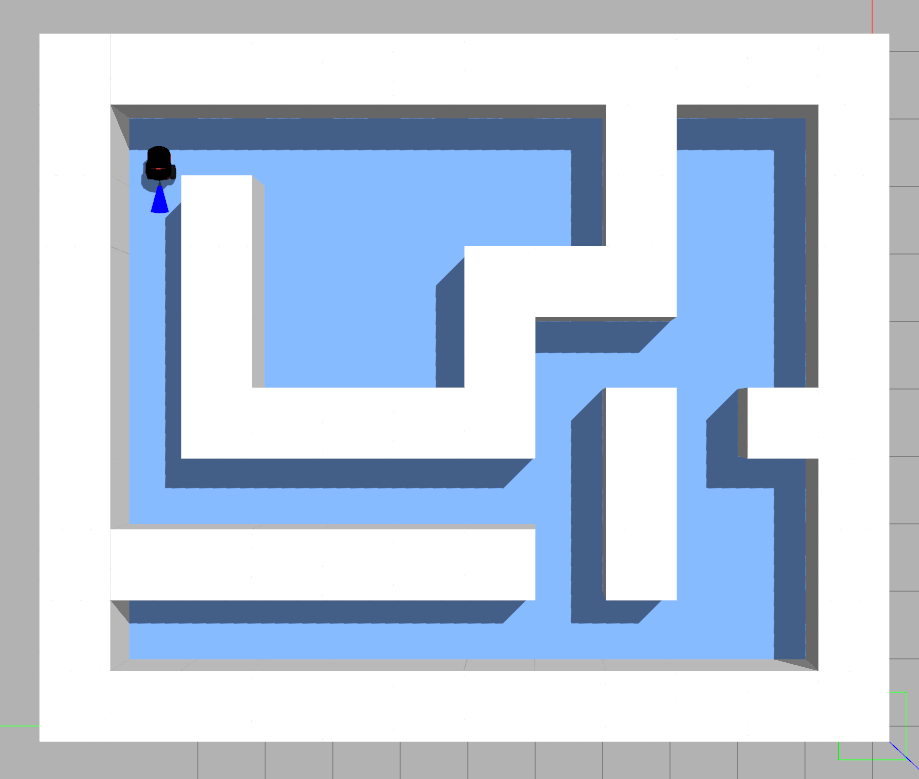
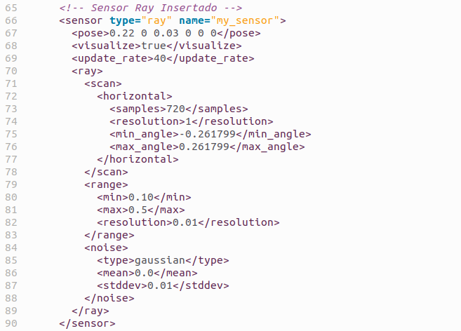
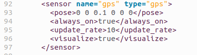

# EntregaGazebo
## Tabla de Contenidos
1. [Introducción](#Introduccion)
2. [Pioneer](#Pioneer)
3. [Controlador](#Controlador)
4. [Conclusión](#i4)
## Introducción 
Tal y como se meciona en el guión se genera un laberinto de tamaño 10x12 (Según mi nombre) utilizando la herramienta proporcionada. El mapa es el siguiente:

Se posicion el robot pionner en el inicio (10.5,8.5). Por lo que se determina que el punto final se encuentra en la coordenada (1.5,1.5) ya que es la esquina opuesta. Se edita el suelo para añadirle un color azul mas vistoso.

## Pioneer 

### Cambios en el modelo 

Se añade un sensor, utilizando el codigo propocionado, pero se cambia el angulo de vision y el alcance del mismo.  

-Se añade un gps, el cual se utiliza con el fin de indicar al robot cunado ha llegado a meta para poder detenerse e imprimirlo por pantalla. 

## Controlador 
### Video
[Enlace](https://youtu.be/G5IKbE7ssrU)
### Descripcion
El controlador usa una logica muy simple, hace avanzar al robot hasta encontrar una pared. Cundo se topa con una pared realiza un giro de 90 grados y sigue avanzando (sino se topa con ninguna pared de nuevo). Finalmente se añade la detencion del robot cuando llega a meta. Como podemos observar es un controlador muy simple que no podria resolver ciertos mapas. Sin embargo, esto podría corregirse añadiendo un componente de aleatoriedad a los grados que gira y la direccion del giro. 

## Conclusion 
Ambos algoritmos logran alcanzar la meta, pero presentan ciertas limitaciones:
### 
A*: Al depender de la odometría, tiende a acumular errores a lo largo del recorrido, a pesar de los esfuerzos por minimizar este efecto. ¿Funcionaría mejor con GPS? En teoría, sí, pero solo en esta simulación, donde el GPS no introduce error (aunque en Webots se puede añadir). En un entorno real, los GPS suelen tener un margen de error superior a un metro, lo que los haría poco útiles para este propósito.
### 
Algoritmo de seguimiento de paredes: Su lógica es más sencilla y se puede mejorar fácilmente para reducir colisiones innecesarias contra las paredes. Sin embargo, este tipo de enfoques presentan el riesgo de quedar atrapados en bucles, girando alrededor de "islas" dentro del laberinto sin encontrar la solución.

